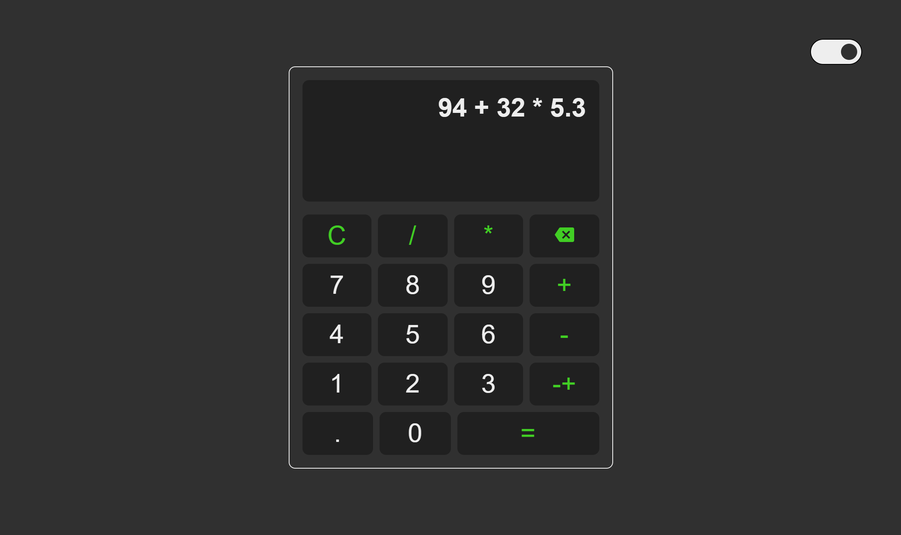

<h1 align="center">
  Calculadora em React
</h1>

  <a href="#-tecnologias">Tecnologias</a>&nbsp;&nbsp;&nbsp;|&nbsp;&nbsp;&nbsp;
  <a href="#-projeto">Projeto</a>&nbsp;&nbsp;&nbsp;|&nbsp;&nbsp;&nbsp;
  <a href="#-funcionalidades">Projeto</a>&nbsp;&nbsp;&nbsp;|&nbsp;&nbsp;&nbsp;
  <a href="#-como-executar">Como executar</a>

 

  

## 🧪 Tecnologias

Esse projeto foi desenvolvido com as seguintes tecnologias:

- [React](https://reactjs.org)
- [Styled-Components](https://styled-components.com/)

## 💻 Projeto

<h4> Acesse em: https://calculadora-react.vercel.app </h4>

Este projeto é um app de calculadora simples para praticar React e Styled-Components.

## 💣 Funcionalidades

- Tema dark e light
- Calcular expressões simples

## 🚀 Como executar

- Clone o repositório
- Instale as dependências com `yarn`
- Inicie o servidor com `yarn start`

Agora você pode acessar [`localhost:3000`](http://localhost:3000) do seu navegador.

---

<h4 align="center"> Feito com ♥ por Marcelino Teixeira </h4>
